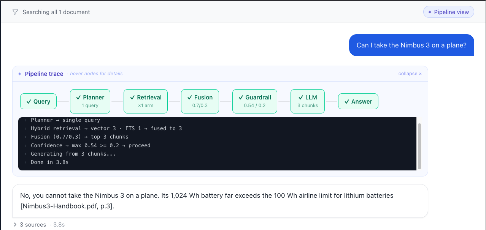
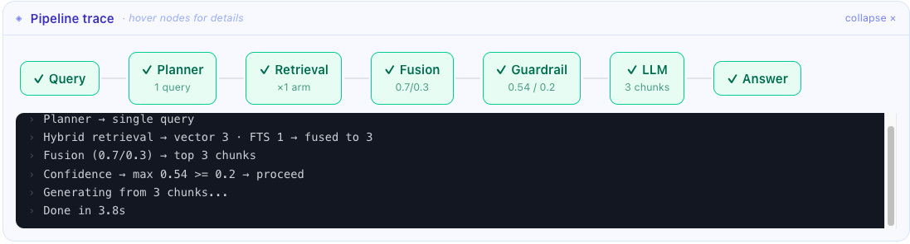
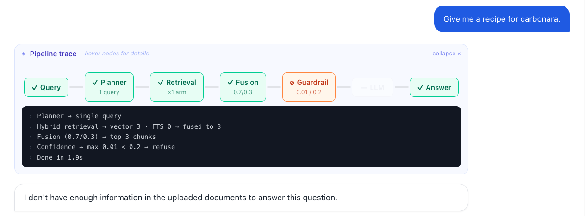

# DocChat | Chat With Your Docs

DocChat is a small RAG app for asking questions over uploaded documents. It
supports PDFs, text, and Markdown files, returns cited answers, and shows the
retrieval pipeline while each answer is being built.

I chose the Chat With Your Docs option because it is simple to understand, but
still exercises the important AI engineering pieces: retrieval quality,
conversation context, guardrails, observability, and evaluation.

## Author Note

I built DocChat to be small enough to understand quickly, but complete enough to
show the important parts of a real RAG product. You can upload a couple of
documents, ask natural questions, and get answers that show where they came from.
The UI is intentionally not just a chat box. It exposes the pipeline live because,
for a RAG system, the answer alone does not tell the full story. I wanted reviewers
to see when the system planned, searched, fused results, checked confidence,
generated, or refused.

The main engineering choice was to keep the system explicit. There is no big
orchestration framework hiding the work: the backend has a planner, hybrid
retrieval, fusion, a confidence guardrail, and generation. Conversation memory is
handled by rewriting follow-up questions into standalone queries before retrieval.
That makes the app feel like chat, but still keeps the retrieval step grounded in
clear document search.

## What It Does

- Upload PDFs, text, or Markdown files.
- Ask natural questions about the uploaded documents.
- Get answers with file and page citations.
- Ask follow-up questions without repeating the full context.
- Watch the live pipeline trace for planning, retrieval, fusion, guardrail, and generation.
- Scope a question to selected documents.
- Refuse off-topic questions when the document evidence is too weak.

## Screenshots







## Quick Start

Requirements

- Docker
- OpenAI API key

```bash
cp .env.example .env
# edit .env and set OPENAI_API_KEY

docker compose up --build
```

App URLs

- Frontend at <http://localhost:3000>
- Backend API at <http://localhost:8000>
- Health check at <http://localhost:8000/health>

Then open the frontend, upload a document, and ask a question.

Useful demo prompts

```text
Hello
What project options does the assignment ask me to choose from?
And what does it say I should submit?
Give me a recipe for carbonara.
```

## Architecture

```text
Frontend, Next.js
  |
  | HTTP and SSE
  v
Backend, FastAPI
  |
  | stores chunks, vectors, and full-text index
  v
Postgres with pgvector

OpenAI is used for embeddings, planning, and generation.
```

Question flow

1. The planner classifies the message as greeting, meta, or document question.
2. For document questions, it rewrites follow-ups into standalone questions.
3. Retrieval runs vector search and Postgres full-text search.
4. Fusion ranks the candidates and keeps the best chunks.
5. The guardrail checks whether the strongest match is above the confidence threshold.
6. Generation answers using only the retrieved chunks and returns citations.

Greeting and meta questions short-circuit. They do not run retrieval or generation.

## RAG Decisions

| Area | Choice | Why |
|---|---|---|
| LLM | OpenAI `gpt-4.1-mini` | Fast enough for planning and answer generation. |
| Embeddings | OpenAI `text-embedding-3-small` | Good quality for the scope and inexpensive. |
| Vector store | Postgres with pgvector | One database for documents, vectors, and full-text search. |
| Retrieval | Vector search plus Postgres full-text search | Semantic search handles meaning. Full-text helps with exact terms. |
| Orchestration | Custom pipeline | The flow is small enough to keep explicit. |

Chunking is character based, around 1500 characters with overlap. PDFs are split
per page so citations can include page numbers.

Conversation memory is stateless on the backend. The frontend sends the last few
chat messages with each request. The planner uses that history to rewrite a
follow-up like `And what does it say I should submit?` into a standalone query
before retrieval.

The confidence guardrail uses the best raw vector score. If the score is below
`0.20`, the app refuses instead of calling the generation model.

## Testing And Evaluation

Validation commands

```bash
docker compose build frontend

pip install -r backend/requirements.txt -r backend/requirements-dev.txt
(cd backend && python -m ruff check .)

docker compose exec backend python -m pytest tests/test_planner_intent.py
(cd backend && python -m pytest)
```

The backend includes unit tests for chunking, fusion, planner intent parsing, SSE
utilities, eval scoring, and database behavior with fake embeddings.

There is also an eval harness in `backend/evals`. It uses a golden set to check
retrieval hit rate, citation accuracy, answer match, refusal behavior, and document
scoping. I used it to tune the `0.20` confidence threshold instead of choosing it
by feel.

## Key Technical Decisions

I used FastAPI because it keeps the API small and readable. I used Postgres with
pgvector because it avoids running a separate vector database for this scope. I
used OpenAI for both embeddings and generation because it made the model layer
simple and consistent.

I did not use LangChain or LangGraph. For this project, the pipeline is easier to
review when it is written directly. If I added long-running agent workflows or
tool use, I would revisit that decision.

I kept chat history in the frontend instead of adding server-side sessions. This
keeps the demo simple and makes token usage predictable. In production, I would
persist conversations and add smarter memory selection or summarization.

## Engineering Standards

Followed

- Docker Compose for one-command local setup.
- Typed API models with Pydantic.
- TypeScript in the frontend.
- Ruff linting for backend code.
- Unit and integration tests where they give clear value.
- Eval harness for RAG quality.
- Structured logging with `structlog`.
- Conventional commits during development.
- Secrets kept out of the repository.

## AI-Assisted Development

I started from a system design and used AI agents to build against it. One agent
acted as an orchestrator that planned and reviewed the work, and another wrote the
code. I made the decisions about the features and the system design, and the agents
helped me implement them.

## Production Plan

To productionize this on AWS, GCP, Azure, Cloudflare, or Vercel, I would add
these pieces.

- Managed Postgres with pgvector.
- Connection pooling.
- Auth and tenant isolation.
- Server-side conversation sessions.
- Secrets manager and key rotation.
- Queued ingestion for larger files and batches.
- Embedding cache.
- Reranking for larger document sets.
- OpenTelemetry traces and dashboards for latency, tokens, retrieval scores, and refusal rate.
- CI gates for lint, tests, Docker build, and deployment.

## What I Would Improve Next

- Add persisted conversations with `conversation_id`.
- Add a reranking stage for larger document sets.
- Make the eval set harder and more diverse.
- Add a document delete action in the UI.
- Add production observability dashboards.

## Known Limitations

- Chat history is currently held in the browser and lost on refresh.
- There is no authentication or multi-user isolation.
- Exhaustive questions like "list every mention of X" are not handled as a special mode.
- The set of evaluation documents is small and should be expanded for a real production system.
